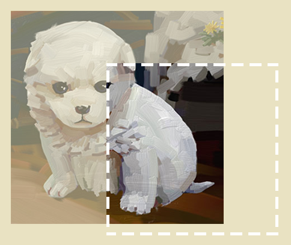

1. canvas 图形（如霓虹灯文字）如何放到真正的网页里，

   首先，canvas 就是一个HTML 标签，我们在html 写出<canvas></canvas> 的时候，它就在网页里了。

   通常，canvas 会用div 包裹起来的，给div 一个尺寸，canvas 的width、height 属性再自适应div 的尺寸。这样，我们通过css 控制div 的时候，也就影响到了canvas。

   

2. 银行家舍入

   口诀：四舍六入五考虑，五后非空就进一，五后为空看奇偶，五前为偶应舍去，五前为奇要进一。

   四舍：10.4 -> 10    

   六入：10.6 -> 11    

   五考虑：

   ​	五后非空就进一：10.51 -> 11

   ​	五后为空看奇偶：

   ​		五前为偶应舍去：10.5 -> 10    

   ​		五前为奇要进一：11.5 -> 12 

   

   

3. putImageData(ImageData, dx, dy, dirtyX, dirtyY, dirtyWidth, dirtyHeight) 中的dirtyWidth, dirtyHeight 裁剪尺寸超出图片范围，会怎么样？

   能裁多少裁多少。

   

4. putImageData() 在实际工作中的应用

   putImageData() 可以将被加工过的ImageData 对象绘制到画布中。

   canvas的像素级操作，可以实现放大镜、取色器、图片滤镜等功能。

   我在京东的时候，就有一个开心农场的项目，要在网页中为商家提供一个调整蔬菜饱和度、对比、亮度的功能，这就需要像素级操作。
   
   
   
5. 灰度在哪里找到

   从canvas 中获取的像素，只提供了里rgba 数据，这里面没有灰度。
   
   像素的灰度需要用公式计算。
   
   灰度=0.299*r+0.587*g+0.114*b 

6. save restore 的使用

   save restore 的使用，是以具有独立样式的图形对象为单位的。这是为了避免绘制当前的图形时所设置的上下文状态影响以后所要绘制的的图形。  

   

7. 图层

   canvas 里没有图层的概念，他就是一张画布，一层层上面刷颜色。已经绘制到canvas 中的图像不可被修改，只能被覆盖或者擦除。如果我们想要改变图形的绘制顺序，那我们只能再按照我们想要的顺序重新画一遍。

